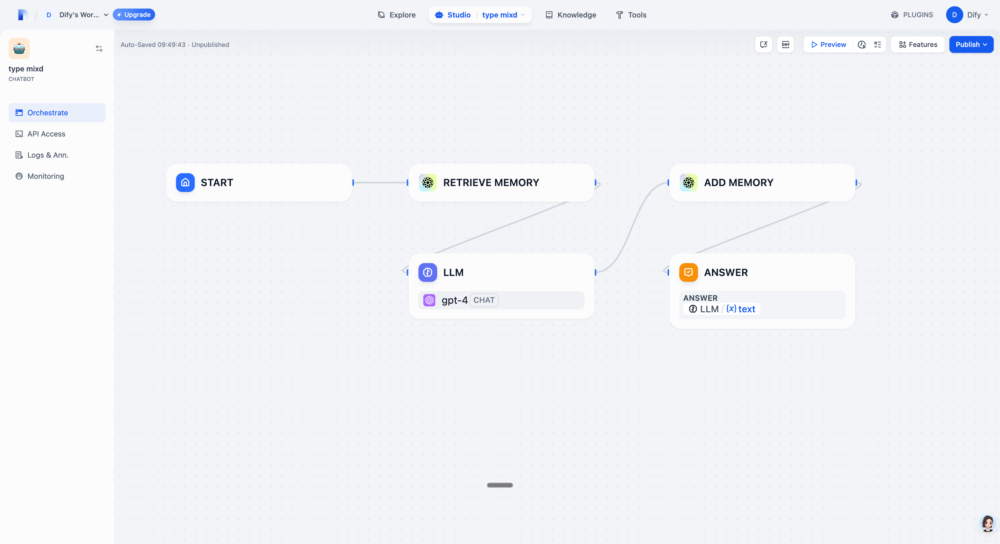
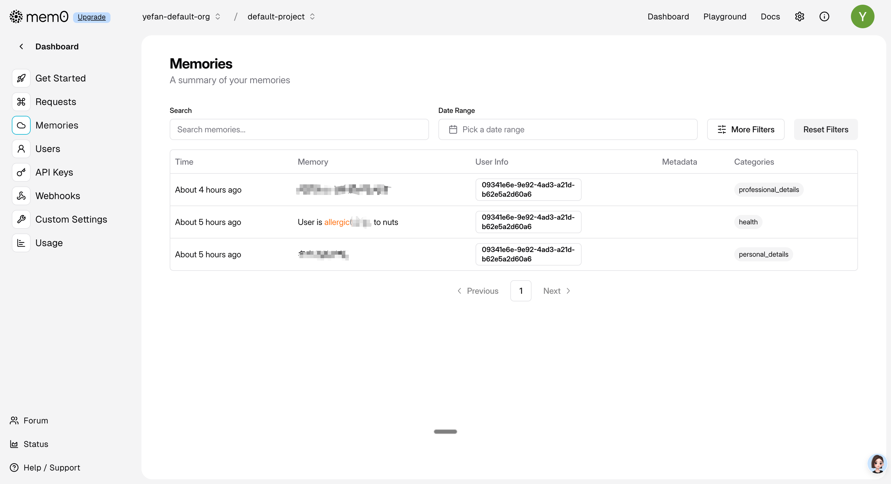

## mem0

**Author:** yevanchen
**Version:** 0.0.1
**Type:** tool

### Description

mem0 is a memory management plugin that enables conversation history storage and retrieval for LLM applications.




### Setup

#### Option 1: Using Official mem0 Cloud Service

1. Get your API key from [mem0 dashboard](https://app.mem0.ai/dashboard/api-keys)
2. Install the package:
```bash
pip install mem0ai
```

3. Initialize the client:
```python
from mem0 import MemoryClient
client = MemoryClient(api_key="your-api-key")
```



#### Option 2: Using Self-Deployed mem0 Instance

For self-deployed mem0 instances, you can configure the plugin to use your own server:

1. **Setup your self-deployed mem0 instance** following the [mem0 self-hosting guide](https://github.com/mem0ai/mem0)

2. **Configure the plugin in Dify:**
   - **Base URL**: Enter your mem0 instance URL (e.g., `http://localhost:8000` or `https://your-mem0-server.com`)
   - **API Key**: Optional - leave empty if your instance doesn't require authentication, or provide your custom API key

3. **Local development example:**
```python
# For local mem0 instance without authentication
from mem0 import MemoryClient
client = MemoryClient()  # No API key needed for local instance

# For local mem0 instance with custom configuration
client = MemoryClient(
    config={
        "vector_store": {
            "provider": "chroma",
            "config": {
                "collection_name": "test",
                "path": "db",
            }
        }
    }
)
```

4. **Configuration Options:**
   - **mem0_base_url** (optional): Base URL of your mem0 instance
     - Default: `https://api.mem0.ai` (official service)
     - Example: `http://localhost:8000` (local instance)
     - Example: `https://your-domain.com` (custom deployment)
   - **mem0_api_key** (optional): API key for authentication
     - Required for official mem0 service
     - Optional for self-deployed instances (depends on your configuration)

### Memory Actions

#### add_memory
Stores conversation history and context for users.

```python
messages = [
    {"role": "user", "content": "Hi, I'm Alex. I'm a vegetarian and I'm allergic to nuts."},
    {"role": "assistant", "content": "Hello Alex! I've noted your dietary preferences."}
]
client.add(messages, user_id="alex")
```

Backend logic:
- Messages are stored in user-specific partitions using `user_id`
- Supports conversation history and context storage
- Handles message format validation and processing
- Optimizes storage for efficient retrieval

#### retrieve_memory
Retrieves relevant conversation history based on queries.

```python
query = "What can I cook for dinner tonight?"
memories = client.search(query, user_id="alex")
```

Backend logic:
- Semantic search across user's memory partition
- Returns relevant conversation snippets
- Handles context ranking and relevance scoring
- Optimizes query performance

### Usage in Dify

1. In Dify workflows, place `retrieve_memory` before LLM calls to provide context
2. Add `add_memory` after LLM responses to store new interactions
3. `user_id` can be customized in workflow run API
4. Note: iframe and webapp modes currently don't support user_id due to lack of access control

### Maybe Future Features
- Multimodal Support
- Memory Customization
- Custom Categories & Instructions
- Direct Import
- Async Client
- Memory Export
- Webhooks
- Graph Memory
- REST API Server
- OpenAI Compatibility
- Custom Prompts


